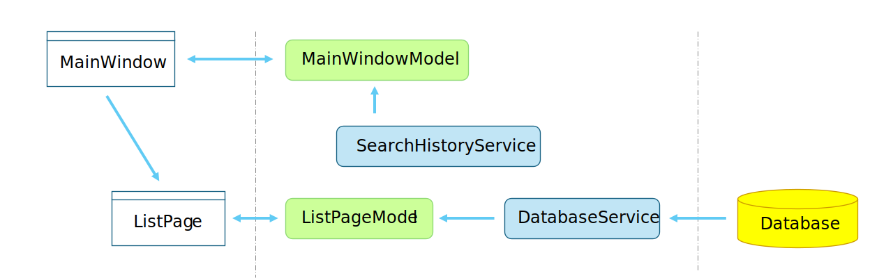

# TagNotes
## 概要 Overview  
### メンバー Member
Author : 造田 崇（[zoppa@ab.auone-net.jp](mail:zoppa@ab.auone-net.jp)） 
### 目的 Goal
<!-- 
「このソフトウェアの目的はXXXであり、XXXを実現することが目標である。」と記述するのが基本形。
この後の設計で迷ったときに、ここに立ち戻って判断することもあり、できるだけ明確に書いておくことが重要。
-->
このソフトウェアの目的はメモを編集、保持、検索することであり、メモを利用して物忘れをしにくくすることが目標である。  
* メモの操作
  * メモを追加、編集、削除できること
  * メモをワード、ハッシュタグで検索できること
  * メモは時系列に降順ソートして表示すること
* 指定した日時で通知を行うこと
* リンクをクリックしてフォルダを開く、URLを開くこと  
  
### 目指さないこと Non goal
<!--
非機能要件などで、明示的に目標ではないことが選択されているものを記述する。
-->
* メモを複数端末で共有化しない  
* 学習目的で作成しているため、メンテナンス性を考慮しない  
  
### 背景 Background  
<!--
新しいシステムをなぜ構築するか、実際に何が構築されようとしているのかざっくり説明する。
-->
メモを保持するアプリは色々あるが付箋アプリではメモに通知がなく、TODOアプリでは検索機能がない。  
UIをXに近づけて、検索と通知機能を含めると新しいメモアプリを提案できるのではないかがきっかけで開発する。   
ただし、学習目的で作成するため、製品のような価値を提供しない。    
### システム範囲 System scope
<!-- 
システム範囲とは、プロジェクトやシステムがカバーする範囲や制限を指します。具体的には、以下のような項目が含まれます：
対象領域：システムがどの業務や機能をサポートするか
対象外領域：システムが対応しない業務や機能
ユーザー：システムを使用する人々や組織
インターフェース：他のシステムやデータベースとの連携部分
制約条件：システム設計や開発における制約や前提条件
-->
スタンドアロン、シングルユーザーで使用する。
    
## 設計 Design
### 概要 Overview
簡潔な`MVVM`モデルを使用する。  
  
* `Models`名前空間はModel層、View Model層を実装   
* `MainWindow`、`Views`名前空間はView層を実装  
* `Services`名前空間は機能を実装  
* `Helper` は共通処理を実装   
  
### 依存関係 Dependency  
`.NET 8`を使用した画面アプリケーションとする。  
* 画面は`WinUI3`を使用する
* OSは`windows10.0.19041.0`以降
* DIは`Microsoft.Extensions.DependencyInjection`を使用する
* MVVMライブラリは `CommunityToolkit.Mvvm`を使用する
* データベースはファイルDB`SQLite3`を使用する
* データベースアクセスは`ZoppaDSqlMapper`を使用する

### 詳細 Detailed  
#### 起動
DIコンテナを使用してインスタンスを生成したいため、テンプレートの起動プロセスを変更して`Program`クラスにエントリポイント`Main`メソッドを作成した。  
`Main`メソッドから以下の処理を行う。  
1. サービスプロバイダ（`Microsoft.Extensions.DependencyInjection.ServiceProvider`）の作成
1. 各サービスの初期化
    1. データベースサービス（`DatabaseService`）の初期化
    1. 通知メッセージサービス（`NotificationMessageService`）の初期化
    1. 検索履歴サービス（`SearchHistoryService`）の初期化
1. アプリケーション（`Application`）クラスからメインウィンドウ（`MainWindow`）の表示
    1. アプリケーション（`Application`）クラスを生成
    1. アプリケーション（`Application`）クラスの起動イベント発生（`OnLaunched`）
    1. メインウィンドウ（`MainWindow`）クラスを生成、表示  
1. メインウィンドウ（`MainWindow`）のロードイベント(`NavView_Loaded`)時にリストページ（`ListPage`）にメモを検索して表示する  
   
    1. メインウィンドウ（`MainWindow`、`MainWindowModel`）のロードイベントで検索履歴サービス(`SearchHistoryService`)から最新の検索条件を取得し、リストページ(`ListPage`)へ遷移する  
    1. 取得した検索条件でデータベースサービス(`DatabaseService`)からメモを検索し、検索結果を画面に表示する
  
#### 検索  
1. ナビゲーションビューの選択変更イベント(`NavView_SelectionChanged`)を補足する
1. 上記イベントで検索が選択されていたら検索を実行  
    1. 検索ダイアログを表示
    1. 入力された検索条件を取得、検索履歴サービスの検索履歴を更新
    1. 検索条件で検索する
1. 検索結果を表示する  
  
#### 追加と更新、削除  
メモの編集ダイアログ(`AddOrEditDialog`、`NoteDialogModel`)で入力された情報を元にデータベースサービス(`DatabaseService`)を使用して、メモの追加と更新、削除を行う。  
メモを追加時に通知日時の設定があれば通知日時、通知日時の5分前、～ 通知日時の3日前の通知日時も追加する。  

#### 通知  
通知メッセージサービス（`NotificationMessageService`）の初期化時に監視スレッド(`Observe`)を起動する。  
監視スレッドでは定周期でデータベースサービス(`DatabaseService`)から通知日時が現在時刻以前のメモを収集する。  
収集したメモが 1件以上ならば通知する。
　　
### ストレージ Storage  
<!--
データを保存するシステムでは、保存がいつ、どのような形で発生するのかを議論する必要があります。
ここでも完全なスキーマ定義をコピペするのではなく、やはり設計とのトレードオフに関連する部分に焦点を当てた内容を記載することとしています。
-->
| 名前 | 説明 |
|:-----|:-----|
| ShortItem | メモを保持する。 |
| ShortTag | メモに紐付いてハッシュタグを保持する。 |
| ShortNotification | メモに紐付いて通知日時を保持する。 |
| Condition | 検索履歴を保持する。 |  
  
<!-- ### 使用例 Usage example -->
<!--
ライブラリならばコードを使って、使用例を記述する。
-->
<!-- ### 特殊なアルゴリズム Special algorithm -->
<!--
プロジェクトに特殊なアルゴリズムを含む場合、そのアルゴリズムの説明をする。
疑似コードを使用して説明しても良い。
-->

## 運用 Operation  
<!--### 運用計画 Operation plan -->
<!--
運用に前提条件が必要ならば記述する。
-->
### テスト計画 Test plan
* 単体テスト  
`Models`、`Services`、`Helper`名前空間はテストプロジェクト（`TagNotesTest`）でテストする。  
* 結合テスト  
実操作して、`Views`名前空間をテストする。  
* システムテスト  
省略。  
  
<!-- ## 検証 Verification -->
<!-- ### ソリューションの制約 Solution constraint -->
<!--
Design Docsにおいてソフトウェアの設計へ影響を与える主な要因の1つは、設計するソリューションの制約の度合いです。
解決策が明確に定義されているが、目標を達成するためにその解決策をどのように組み合わせればよい(新規のソリューション同士や既存のシステムに対する拡張等で)のか分からない場合があったとします。
これは変更するのが難しいですし、もし既存のシステムへの拡張をするとなった場合、既存のシステムがレガシーにより特定の制約がかかってしまうというということを指しています。
この場合においてもDesign Docsでは、複数の解決策を列挙していき、想定され得るすべてのトレードオフを考慮して最善の方法を選択することに焦点を当てる必要があります。
-->

<!-- ### 検証した代替案 Validated alternatives -->
<!--
ここでは、検討した結果、推しの設計と同様の結果を達成できる代替の設計を列挙していきます。
それぞれの設計においてのトレードオフとそのトレードオフの結果から推したい設計を選択する際の最終的な決定に繋がったのかに焦点を当て記載します。
最終的に選択されなかったソリューションについては、簡潔に述べて良い。
ただ、選択されたソリューションがプロジェクトの目標と代替のソリューションを考慮して最適である理由を明確に示す必要があることだけが重要です。
-->

<!-- ### 既知の問題 Known issue -->
<!--
システムの既知の問題を記述する。
-->

<!-- ## 横断的な懸念事項 Transversal concerns -->
<!--
ここでは、セキュリティやプライバシー、などの懸念事項が考慮されているのかを示します。
これらの懸念事項が設計にどう影響を与え、どのように対処するのかを説明します。
要があるため)必要があります。
-->

<!-- ## 参考文献 References -->
<!--
参考にした文献を箇条書きで記述する。
-->

## 格納場所、リポジトリ Storage location, repository
<!--
共有フォルダのパス、リポジトリのURLを記述。
-->
Github: [https://github.com/zoppa-software/TagNotes.git](https://github.com/zoppa-software/TagNotes.git)
  
## メモ、変更履歴等 Notes, change history, etc.  
<!--
何でもないメモ、変更履歴、その他を記述する。
-->
<!-- ### メモ Notes -->  
### 変更履歴 Change history   
2025/1/1 Design Doc作成
<!-- ### その他 etc -->