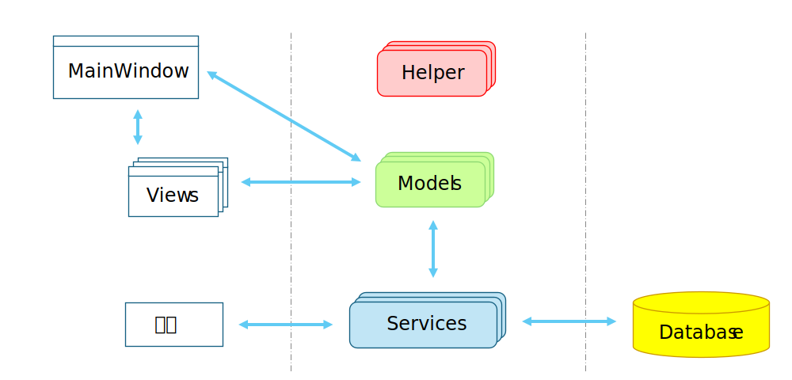

# TagNotes
## 概要  
### メンバー
Autor : 造田 崇（[zoppa@ab.auone-net.jp](mail:zoppa@ab.auone-net.jp)）   
### 背景  
メモをファイルデータベースに保持し、検索できるようにする。  
検索はキーワード、ハッシュタグで検索できるようにする。 
学習目的で作成する。  
### システム範囲
スタンドアロン、シングルユーザーで使用する。
### ゴール
* メモ
  * メモを追加、編集、削除できること
  * メモをワード、ハッシュタグで検索できること
  * メモは時系列に降順ソートして表示すること
* 指定した日時で通知を行うこと
* リンクをクリックしてフォルダを開く、URLを開くこと
### ゴールとしない
* メモを複数端末で共有化しない  
* 学習目的で作成するため、メンテナンス性を考慮しない
    
## システム説明
### 概要
`.NET 8`を使用した画面アプリケーションとする。  
* 画面は`WinUI3`を使用する
* OSは`windows10.0.19041.0`以降
* DIは`Microsoft.Extensions.DependencyInjection`を使用する
* MVVMライブラリは `CommunityToolkit.Mvvm`を使用する
* データベースはファイルDB`SQLite3`を使用する
* データベースアクセスは`ZoppaDSqlMapper`を使用する
### ハイレベルアーキテクチャ

※ `Helper` は共通処理を実装  
  
### 内部実装について
### ストレージ
<!--
### 使用例
-->
<!--
### 特別なアルゴリズム
-->
<!--
### 疑似コード
-->

## 運用
<!--
### 運用方法
-->
### テスト方案
* 単体テスト  
`Models`、`Services`、`Helper`名前空間はテストプロジェクト（`TagNotesTest`）でテストする。  
* 結合テスト  
実操作して、`Views`名前空間をテストする。  
* システムテスト  
省略。  
  
<!-- ## システム検証 -->
<!--
### ソリューションの制約度合
<!--
### 検証した代替案
<!--
### 既知の問題
-->

<!-- ## 横断的な懸念事項 -->

<!-- ## 参考文献 -->

## 格納場所、リポジトリ
Github: [https://github.com/zoppa-software/TagNotes.git](https://github.com/zoppa-software/TagNotes.git)
  
## メモ、変更履歴等
2025/1/1 Design Doc作成